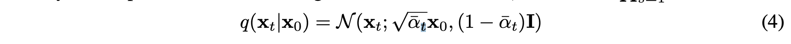
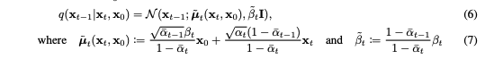

# DDPM

- we dont need to try to recreate x_0 from x_T
- reconstructing x_t only requires x_t+1 and x_0
- therefor when training we randomly sample from the timesteps space to learn a simple transition for the sampled image
- this massively reduces the number of steps but get good coverage of the state transition

## Forward diffusion process

## TODO's

- Read the paper again to check how we are following the methods

- Does loss scalling benfit training 

- Impliment Learned Model variances
    - this only matters if we use KL based Loss 

- learning the noising terms
- Using score based diffusion